# Projet E5 SAB - Urbanisation des SI

Ce document présente la démarche et les étapes réalisées dans le cadre du projet d’urbanisation des systèmes d’information (SI).
## Groupe et Références

- **Membres du groupe :**
    - Mathieu LALANDE
    - Eloise BLAIZOT
    - Amaury DUPRESSOIRE
    - Lucie CADET
    - Anthony BILLON

- [Dépôt GitHub du projet](https://github.com/CringeTM/UrbanSI?tab=readme-ov-file)

- [TP : Projet E5 SAB - Urbanisation des SI (PDF)](docs/pdf/Projet%20E5%20SAB%20-%20Urbanisation%20des%20SI.pdf)

- Ressource que vous nous avez donnée dans le devoir

## Partie 1 : Mise en place de l’environnement

### Choix du framework Kubernetes

Le framework sélectionné pour répondre aux critères du MVP est Minikube.

**Minikube correspond à ce framework, il sera donc utilisé pour la suite du projet.**

### Lancement de Minikube

```bash
minikube start --listen-address=0.0.0.0 --memory=max --cpus=max --kubernetes-version=v1.35.0
```

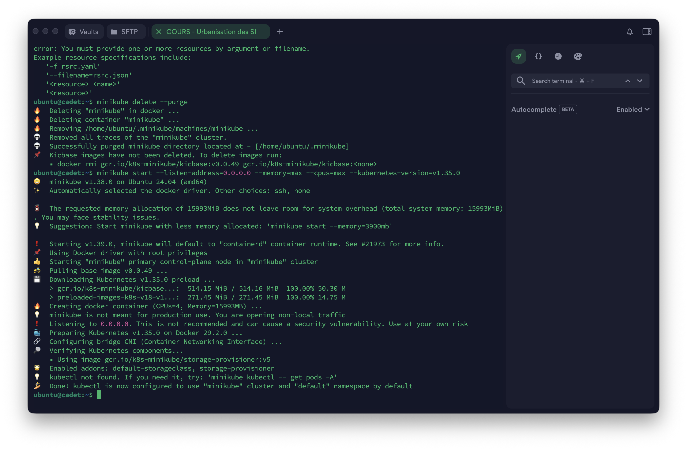

### Chargement de l’image Docker dans Minikube

L’image Docker n’était pas présente dans l’environnement Docker de Minikube, elle avait été construite uniquement dans le Docker local. Il a donc été nécessaire de charger l’image locale dans Minikube pour l’utiliser dans le cluster.

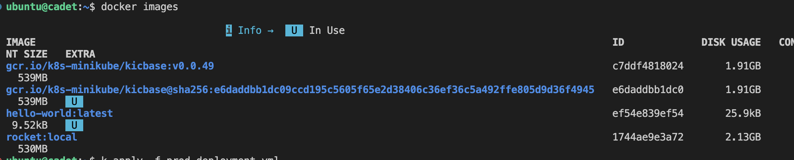

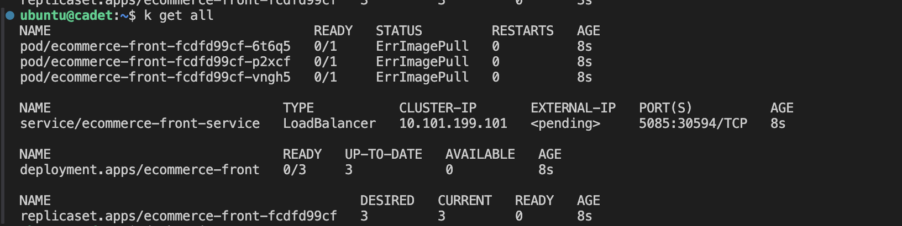

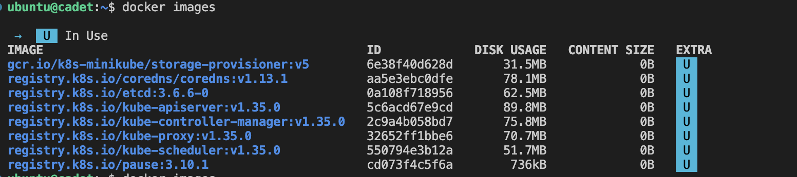

```bash
minikube image load rocket:local
```

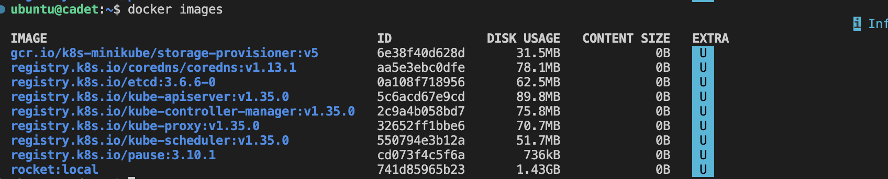

Après avoir fait fonctionner l’image en local, nous l’avons publiée sur Docker Hub afin que les images des applications soient accessibles depuis un repository Docker Hub.

---

### Publication de l’image sur Docker Hub

Pour permettre le déploiement sur différents environnements et garantir l’accessibilité de l’image, celle-ci a été publiée sur un repository Docker Hub public : [warpprod/rocket-ecommerce](https://hub.docker.com/r/warpprod/rocket-ecommerce).

L’image peut ainsi être utilisée directement dans les manifestes Kubernetes via la référence suivante :

```bash
docker build -t warpprod/rocket-ecommerce .
```

```text
[+] Building 14.4s (8/16)                                                                                                                                          docker:default
 => [internal] load build definition from Dockerfile                                                                                                                         0.0s
 => => transferring dockerfile: 1.09kB                                                                                                                                       0.0s
 => [internal] load metadata for docker.io/library/python:3.11.5                                                                                                             0.7s
 => [auth] library/python:pull token for registry-1.docker.io                                                                                                                0.0s
 => [internal] load .dockerignore                                                                                                                                            0.0s
 => => transferring context: 2B                                                                                                                                              0.0s
 => CACHED [ 1/11] FROM docker.io/library/python:3.11.5@sha256:2e376990a11f1c1e03796d08db0e99c36eadb4bb6491372b227f1e53c3482914                                              0.0s
 => => resolve docker.io/library/python:3.11.5@sha256:2e376990a11f1c1e03796d08db0e99c36eadb4bb6491372b227f1e53c3482914                                                       0.0s
 => [internal] load build context                                                                                                                                            0.0s
 => => transferring context: 24.75kB                                                                                                                                         0.0s
 => [ 2/11] COPY requirements.txt .                                                                                                                                          0.3s
 => [ 3/11] RUN pip install --upgrade pip                                                                                                                                    5.2s
 => [ 4/11] RUN pip install --no-cache-dir -r requirements.txt                                                                                                               7.8s 
 => => #   Downloading mysqlclient-2.2.0.tar.gz (89 kB)                                                                                                                           
 => => #   Installing build dependencies: started                                                                                                                                 
 => => #   Installing build dependencies: finished with status 'done'                                                                                                             
 => => #   Getting requirements to build wheel: started                                                                                                                           
 => => #   Getting requirements to build wheel: finished with status 'done'                                                                                                       
 => => #   Preparing metadata (pyproject.toml): started   

 ... etc
```

Après avoir construit l’image, vous pouvez vérifier qu’elle est bien disponible avec la commande suivante :

```bash
docker images | grep warpprod/rocket-ecommerce
```

On peut également spécifier l’image dans vos manifestes Kubernetes comme ceci :

```bash
image: warpprod/rocket-ecommerce:latest
```

Cela assure que toutes les équipes et environnements peuvent accéder à la même version de l’application.

### Initialisation de la base de données et connexion à l’application e-commerce

Après le déploiement de MariaDB, il est nécessaire d’initialiser la base de données et de connecter l’application e-commerce à celle-ci. Pour cela :

1. **Configurer la connexion** :  
    Pensez également à modifier le fichier `requirements.txt` pour ajouter la dépendance suivante :  

    ```python
    PyMySQL==1.1.0
    ```

2. **Vérifier la connexion** :  
    Nous avons ensuite accéder à PhpMyAdmin via le port exposé (`localhost:8080`) pour vérifier que les tables ont bien été créées et que l’application communique correctement avec la base MariaDB.

Après avoir initialisé la base de données, l’application e-commerce est désormais connectée à MariaDB déployée dans le cluster Kubernetes.

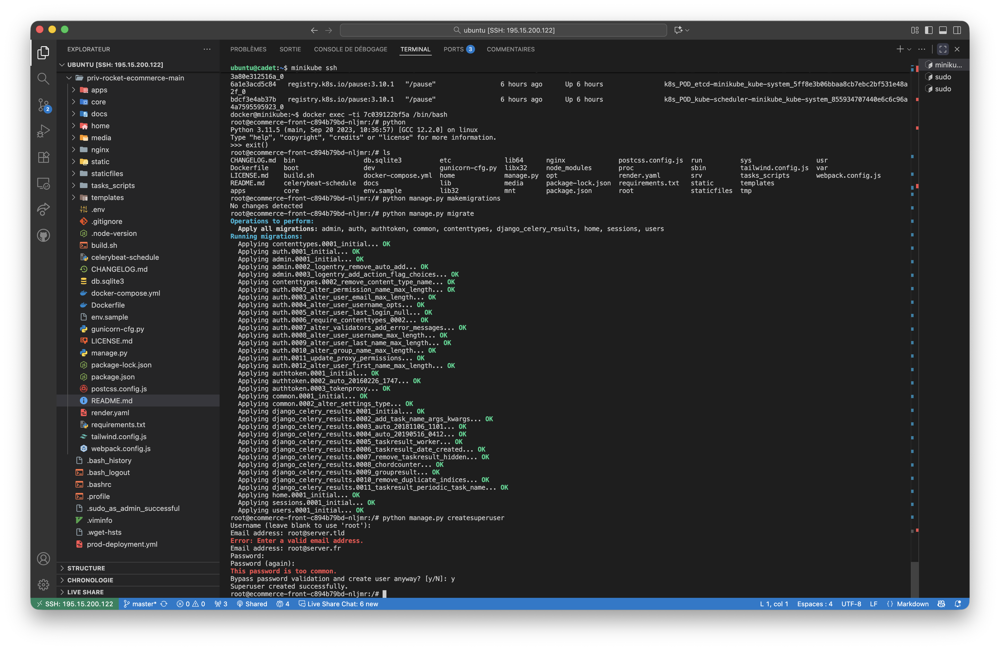

Nous avons ensuite ajouté un produit **Mug** dans Stripe, qui apparaît bien dans l’interface du site e-commerce :

| Produit ajouté dans Stripe | Affichage du produit sur le site |
|---------------------------|----------------------------------|
| 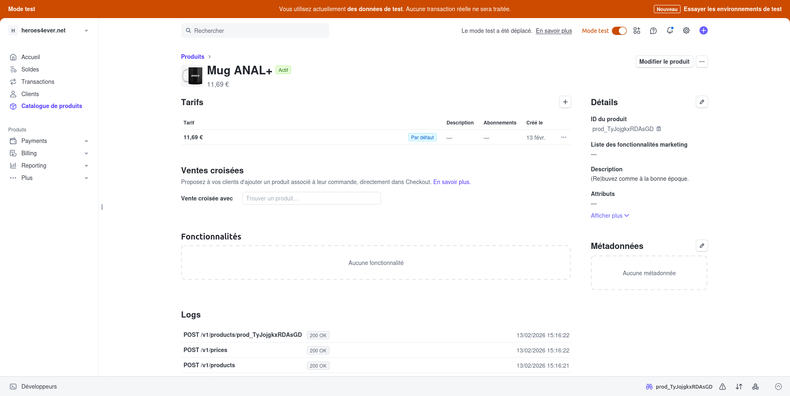 | 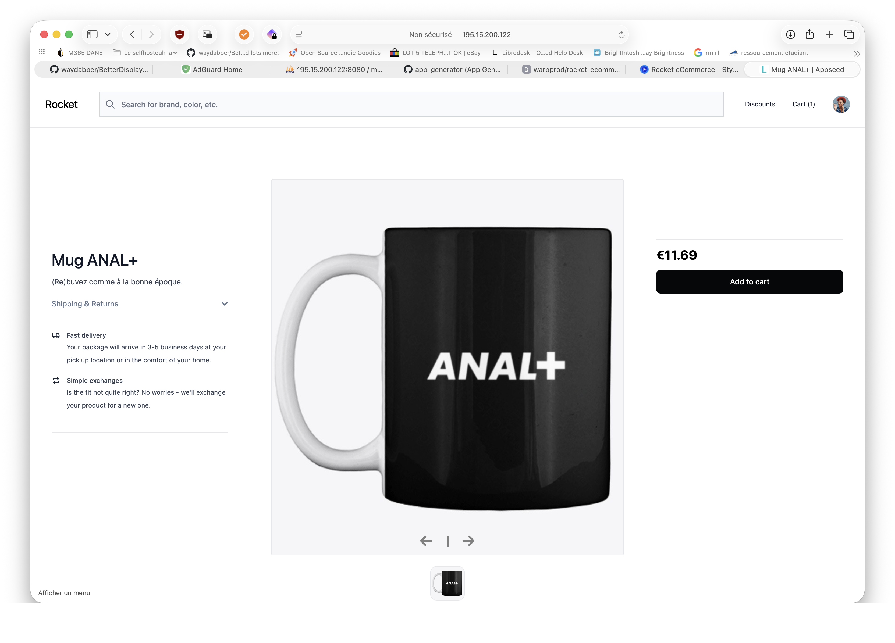 |

Pour valider le parcours d’achat, une transaction a été réalisée depuis le site pour acheter ce **Mug**. La réussite de la transaction est visible à la fois dans Stripe et sur le site e-commerce :

| Transaction réussie dans Stripe | Confirmation sur le site e-commerce |
|---------------------------------|-------------------------------------|
|  | 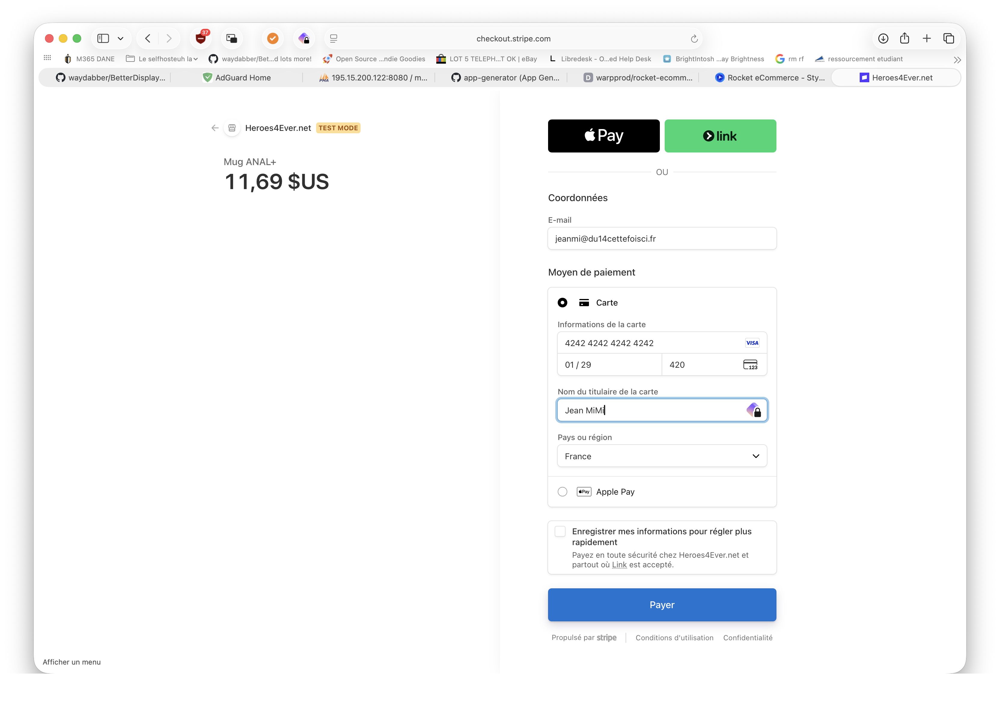 <br> 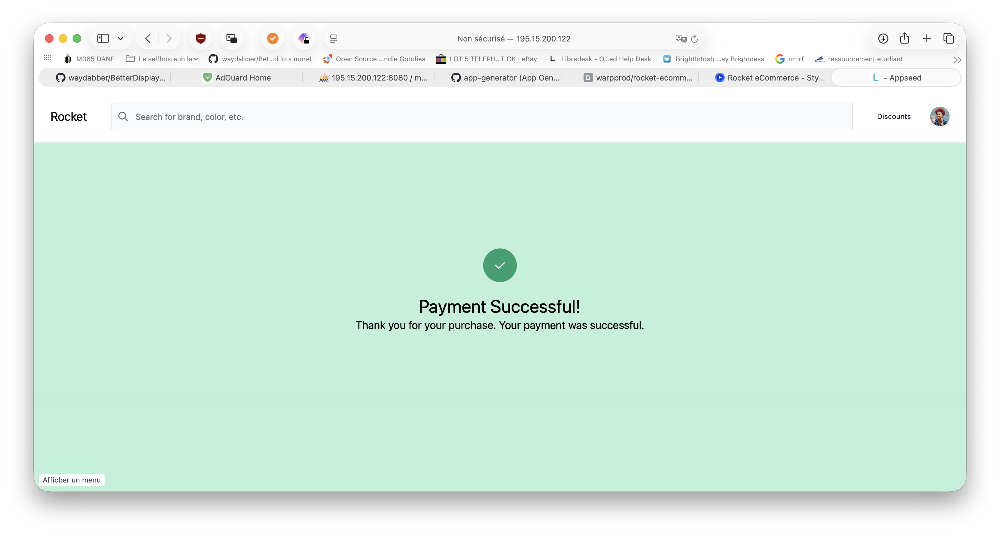 |

Enfin, les informations de la commande et du produit acheté sont bien enregistrées dans la base de données, consultables via phpMyAdmin :

| Commandes dans phpMyAdmin | Produit acheté |
|--------------------------|----------------|
| 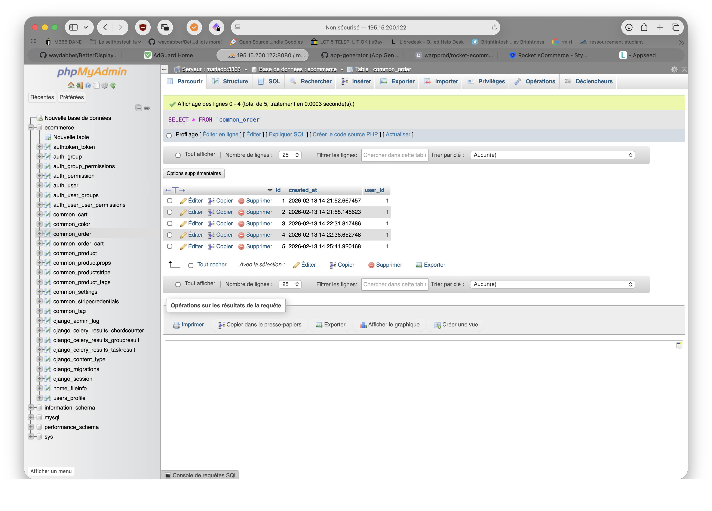 | 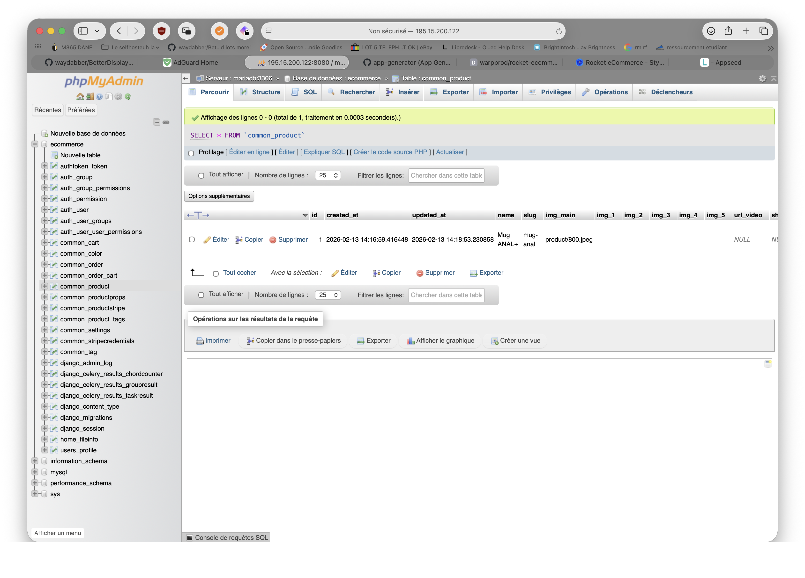 |

### Vérification du nombre de réplicas

Pour garantir la haute disponibilité de l’application, le nombre de réplicas a été défini à 3 dans le manifeste Kubernetes :

```yaml
spec:
    replicas: 3
```

Cela permet d’assurer que trois pods de l’application sont toujours déployés et disponibles dans le cluster.

## Accès à l’application via CURL (interne et externe)

### Accès interne via le LoadBalancer

Le fichier de configuration du LoadBalancer est disponible ici : [prod-deployment.yaml](docs/files/prod-deployment.yaml)

```bash
curl -I 192.168.49.2:31491
```

Réponse :

```text
HTTP/1.1 200 OK
Server: gunicorn
Date: Fri, 13 Feb 2026 09:53:51 GMT
Connection: close
Content-Type: text/html; charset=utf-8
X-Frame-Options: DENY
Content-Length: 20823
Vary: Cookie
X-Content-Type-Options: nosniff
Referrer-Policy: same-origin
Cross-Origin-Opener-Policy: same-origin
```

### Accès externe via le LoadBalancer

```bash
minikube tunnel
```

Retour :

```text
Status:
        machine: minikube
        pid: 42043
        route: 10.96.0.0/12 -> 192.168.49.2
        minikube: Running
        services: [ecommerce-front-service]
    errors: 
                minikube: no errors
                router: no errors
                loadbalancer emulator: no errors
```

---

## Partie 2 : Déploiement multi-environnements

Pour permettre l’accès aux applications à plusieurs équipes, des environnements isolés doivent être créés pour :

- mlops
- preprod
- prod

L’infrastructure as code doit être déployée de façon identique dans ces trois environnements.

### Déploiement multi-environnements

Trois fichiers de déploiement Kubernetes ont été créés pour isoler les environnements :

- [`prod-deployment.yaml`](docs/files/prod-deployment.yaml) : environnement de production
- [`preprod-deployment.yaml`](docs/files/preprod-deployment.yaml) : environnement de préproduction
- [`mlops-deployment.yaml`](docs/files/mlops-deployment.yaml) : environnement MLOps

Chaque fichier contient la même structure d’infrastructure (namespace, déploiements, services, volumes, etc.), adaptée à l’environnement cible.  
Cela permet à chaque équipe de travailler dans un environnement isolé, tout en garantissant la cohérence des ressources déployées.

#### Commande pour appliquer les environnements

```bash
k apply -f prod-deployment.yaml
k apply -f preprod-deployment.yaml
k apply -f mlops-deployment.yaml
```

Commande pour appliquer les modifications :

- 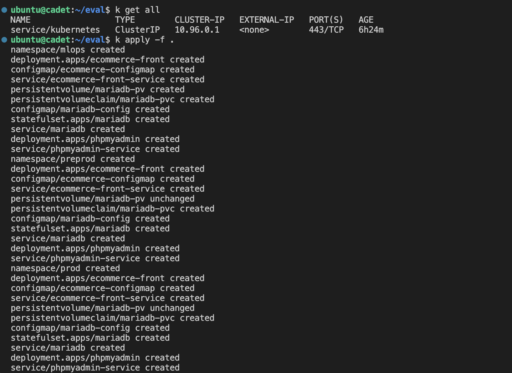

Voici nos informations finales : 

- 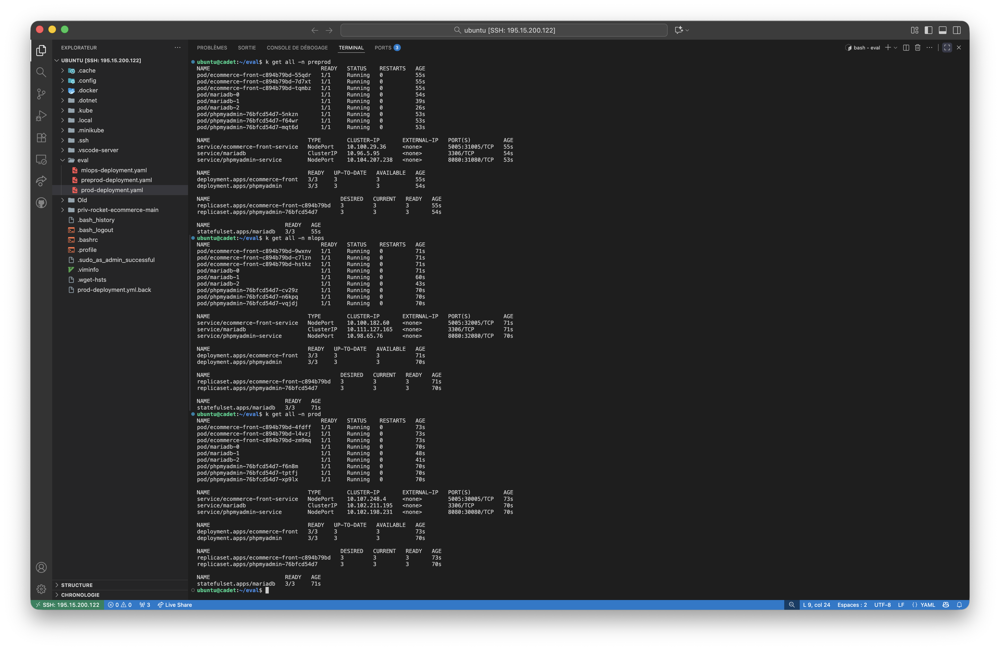

Chaque environnement dispose ainsi de ses propres ressources, assurant l’isolation et la reproductibilité des déploiements.

---

## Partie 3 (facultative) : Intégration d’une base de données

Une base de données autre que SQLite doit être déployée et connectée à l’application Stripe.

### Exemple de configuration MariaDB dans `prod-deployment.yaml`

La documentation [MariaDB sur Kubernetes de IONOS](https://www.ionos.fr/digitalguide/hebergement/aspects-techniques/mariadb-kubernetes/) a été utilisée pour intégrer MariaDB au projet. Le fichier a été adapté pour répondre aux besoins spécifiques.

Nous avons ajouter les namespaces "prod" sur notre fichier pour faire fonctionner MariaDB et PhpMyAdmin.

Pour voir les infos de mariadb, vous pouvez lire `prod-deployment.yaml`.

```yaml
# Principales informations de mariadb
apiVersion: v1
kind: PersistentVolume
metadata:
    name: mariadb-pv
spec:
    capacity:
        storage: 10Gi
    accessModes:
        - ReadWriteOnce
    persistentVolumeReclaimPolicy: Retain
    hostPath:
        path: /mnt/data/mariadb
---
apiVersion: v1
kind: PersistentVolumeClaim
metadata:
    name: mariadb-pvc
    namespace: prod
spec:
    accessModes:
        - ReadWriteOnce
    resources:
        requests:
            storage: 10Gi
---
apiVersion: v1
kind: ConfigMap
metadata:
    name: mariadb-config
    namespace: prod
    labels:
        app: mariadb
data:
    my.cnf: |
        [mysqld]
        bind-address=0.0.0.0
        default_storage_engine=InnoDB
        innodb_file_per_table=1
        max_connections=1000
---
apiVersion: apps/v1
kind: StatefulSet
metadata:
  name: mariadb
  namespace: prod
spec:
  replicas: 3
  selector:
    matchLabels:
      app: mariadb
  serviceName: mariadb
  template:
    metadata:
      labels:
        app: mariadb
    spec:
      containers:
      - env:
        - name: MYSQL_ROOT_PASSWORD
          value: "SuperSecurePass123"
        - name: MYSQL_DATABASE
          value: "ecommerce"
        image: mariadb:latest
        name: mariadb
        ports:
        - containerPort: 3306
          name: mariadb
        volumeMounts:
        - mountPath: /var/lib/mysql
          name: mariadb-storage
        - mountPath: /etc/mysql/conf.d
          name: config-volume
      volumes:
      - configMap:
          name: mariadb-config
        name: config-volume
  volumeClaimTemplates:
  - metadata:
      name: mariadb-storage
    spec:
      accessModes:
      - ReadWriteOnce
      resources:
        requests:
          storage: 10Gi
---
apiVersion: v1
kind: Service
metadata:
    name: mariadb
    namespace: prod
spec:
    ports:
    - port: 3306
      targetPort: 3306
    selector:
      app: mariadb
```

```yaml
# Partie pour phpmyadmin
apiVersion: apps/v1
kind: Deployment
metadata:
  name: phpmyadmin
  namespace: prod
spec:
  replicas: 3
  selector:
    matchLabels:
      app: phpmyadmin
  template:
    metadata:
      labels:
        app: phpmyadmin
    spec:
      containers:
      - name: phpmyadmin
        image: phpmyadmin/phpmyadmin:latest
        env:
        - name: PMA_HOST
          value: mariadb
        - name: PMA_PORT
          value: "3306"
        - name: PMA_ARBITRARY
          value: "1"
        ports:
        - containerPort: 80
---
apiVersion: v1
kind: Service
metadata:
  name: phpmyadmin-service
  namespace: prod
spec:
  type: NodePort
  ports:
  - port: 8080
    targetPort: 80
    nodePort: 30080
  selector:
    app: phpmyadmin
```

```bash
# Afficher toutes les ressources principales Kubernetes dans le namespace courant
k get all
```

Retour :

```text
NAME                       READY   AGE
statefulset.apps/mariadb   1/1     22s
```
